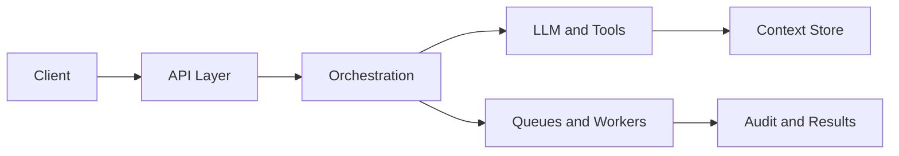
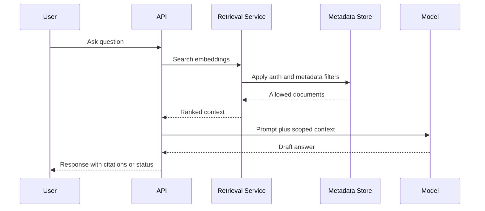
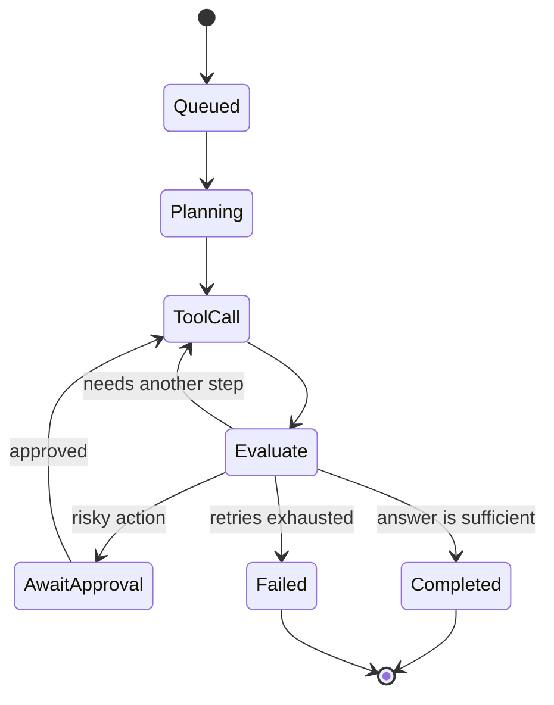
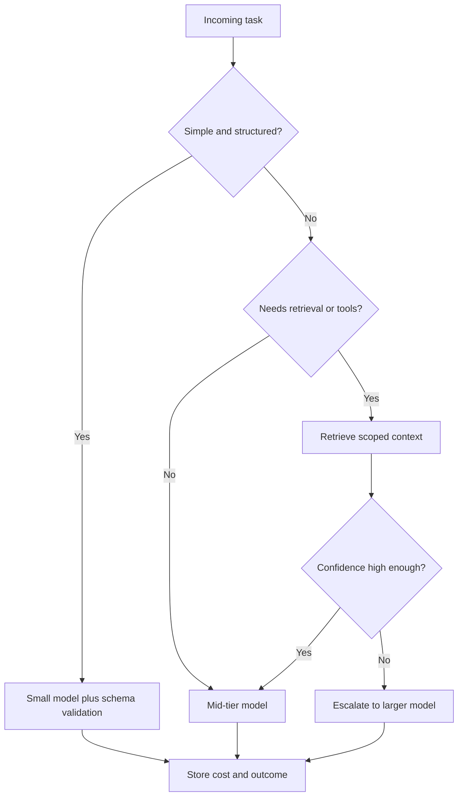

The first AI backend I pushed looked clean on paper: request comes in, model call goes out, response comes back. It broke the moment latency spiked, retrieval pulled noisy context, and the retry returned a different answer for the same input.

That failure changed the way I design backend systems. I stopped treating AI as a smart API dependency and started treating it as a probabilistic workflow that needs orchestration, state, and controls. That shift showed up clearly in production work I shipped on systems like Interview Instructor and AI Kosha.

## The API is no longer the system

The first real shift is that the HTTP layer stops being the center of the architecture.

In a normal backend, the controller is mostly a thin entry point into deterministic business logic. In an AI backend, the controller is just the handoff into a workflow that may retrieve context, call tools, validate output, retry, and persist intermediate decisions. The response is no longer "compute and return." It is often "start, coordinate, and supervise."

I felt this difference fast because my mental model from traditional backend work was still API-first. That model works well for systems like ITPO Venue Booking, where correctness comes from strong transactional logic. It does not hold once the answer depends on prompt quality, retrieval relevance, and model behavior under latency and token pressure.



**Takeaway:** I design AI backends as orchestration systems first and HTTP APIs second.

## Async boundaries stop model latency from leaking into UX

If an AI path can take seconds, branch into retries, or call more than one dependency, I stop forcing it into a synchronous request.

The cleanest improvement I made on AI features was introducing an explicit async boundary at the API layer. The request records intent, enqueues work, and returns a job handle. That gave me safer retries, simpler timeout behavior, and much better user experience because the frontend could poll or stream status instead of hanging on one long request. It also made failures inspectable because the job had its own lifecycle.

This pattern matters even more when the output is evaluative, not just generative. In Interview Instructor style flows, scoring and feedback are not something I want tied to a fragile browser request. I want a durable job, a stored result, and a way to replay or compare runs when the output quality changes after a prompt or model update.

```typescript
@Post("sessions/:id/evaluate")
async evaluate(@Param("id") sessionId: string, @Body() dto: EvaluateDto) {
  const job = await this.aiQueue.add("evaluate-answer", {
    sessionId,
    answer: dto.answer,
  });

  return { jobId: job.id, status: "queued" };
}
```

**Takeaway:** The first production-grade AI decision is usually not model choice, it is where to place the async boundary.

## Context selection becomes backend logic

Prompting is the visible part, but context selection is where accuracy usually gets won or lost.

In regular APIs, data fetching supports business logic. In AI systems, retrieved context becomes part of the reasoning surface itself. That means the backend owns ranking, filtering, authorization, and shaping of context before the model sees anything. A weak context pipeline can make a strong model look useless, while a disciplined context pipeline can make a smaller model perform surprisingly well.

I saw this clearly on retrieval-heavy work like AI Kosha. The hard part is not "connect vector search." The hard part is deciding which document chunks deserve to exist in the prompt, which ones must be excluded, and how to keep user scope, freshness, and metadata filters intact. That is backend logic, not prompt decoration.



**Takeaway:** In AI backends, context engineering is backend engineering.

## Agent loops need durable state, not long HTTP requests

The moment a system can decide, act, inspect, and continue, I stop thinking in terms of one request and one response.

Agent-style behavior creates a loop, and loops need state checkpoints. If I keep that loop inside a single process with in-memory variables, I lose replayability, retry safety, and operational control the moment a worker crashes or a tool call stalls. Durable state lets me resume runs, cap iterations, insert human approval, and audit why a path was taken. Without that, "agent" usually means "timeout with extra cost."

This is the architectural jump many teams underestimate. The model is rarely the hardest part. The harder part is building a runtime that constrains action scope, stores step outputs, and knows when to stop. Once I started treating the loop as a state machine instead of a clever callback chain, failure handling became much more manageable.



**Takeaway:** Agent loops become reliable only when each step is durable, bounded, and resumable.

## Observability has to explain decisions, not just errors

A 200 response from an AI feature tells me almost nothing if the answer quality is still wrong.

Traditional backend observability is necessary but incomplete here. I still need latency, queue depth, and dependency health, but I also need prompt version, retrieved documents, tool calls, token usage, fallback path, and whether the output passed validation. When a user says "this answer got worse," I need enough trace data to compare runs instead of arguing from intuition.

I now log AI execution as a domain event, not a debug side effect. That sounds obvious, but it changes schema design and retention decisions because prompt lineage and output evaluation become part of backend operations. If I cannot replay the chain of reasoning inputs, I cannot fix regressions with confidence.

```typescript
async runStep(input: PromptInput) {
  const startedAt = Date.now();
  const response = await this.llm.generate(input);

  await this.aiRunsRepo.create({
    promptVersion: input.version,
    model: response.model,
    latencyMs: Date.now() - startedAt,
    tokens: response.usage.total_tokens,
    output: response.text,
  });

  return response.text;
}
```

**Takeaway:** For AI systems, observability must capture why the system chose a path, not only whether the path crashed.

## Cost control belongs in the execution plan

Most AI cost problems are architecture problems wearing a billing label.

I do not wait for cloud invoices to tell me a workflow is wasteful. I decide early which requests deserve a large model, which ones can use cached summaries, and which ones should stop after a cheap validation pass. Token spend grows quietly through oversized context, repeated retries, and unnecessary model escalation, so the control point has to live in the workflow itself.

This is counterintuitive for teams used to treating cost as an infra concern. In AI backends, model selection is closer to query planning. If I route everything to the strongest model with full history and raw retrieval output, I am not being safe. I am avoiding design decisions and paying for it later in both latency and margin.



**Takeaway:** If the execution plan does not encode cost discipline, the system will drift toward slow and expensive by default.

## Backend fundamentals still matter more than AI hype

The shift is real, but the winning move is not abandoning backend discipline; it is applying it harder in new places.

I still care about contracts, validation, idempotency, access control, and safe retries. The difference is that now I apply those ideas around probabilistic components. I validate model output shape, I fence tools behind explicit permissions, and I persist enough state to recover from partial failure. AI changed the surface area of the backend, not the need for rigor.

That is probably the biggest lesson I carried from shipping conventional systems and AI systems side by side. ITPO Venue Booking rewarded deterministic correctness. Interview Instructor and AI Kosha forced me to add orchestration, evaluation, and runtime controls on top of the same backend instincts. The architecture shifted, but the engineering standard did not.

```typescript
const ResultSchema = z.object({
  score: z.number().min(0).max(10),
  feedback: z.string().min(1),
});

const parsed = ResultSchema.safeParse(JSON.parse(response.text));
if (!parsed.success) {
  throw new BadGatewayException("Invalid model output");
}

return parsed.data;
```

**Takeaway:** AI backends win in production when backend fundamentals are extended, not replaced.
