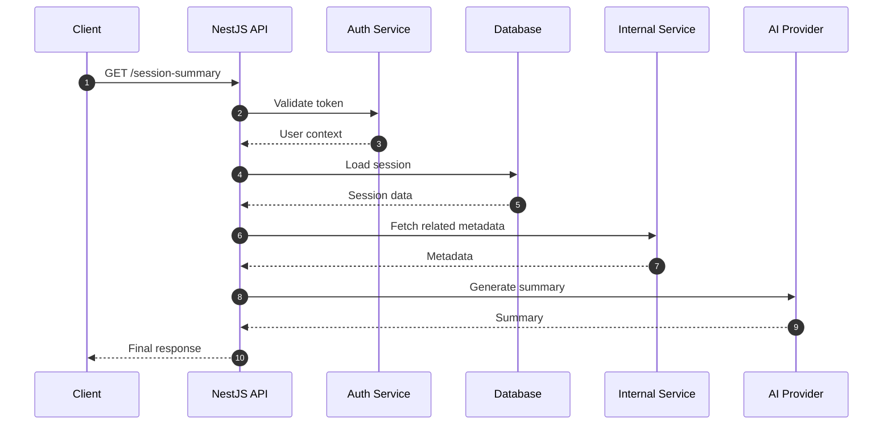
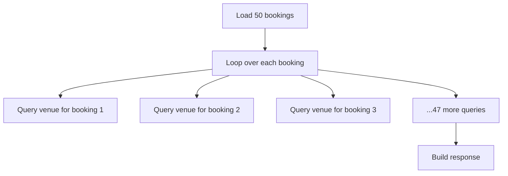
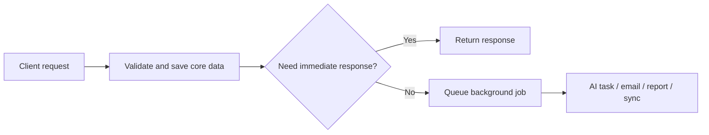
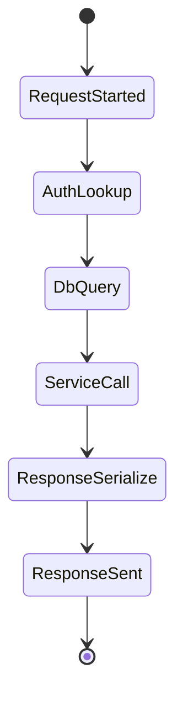

I’ve seen this mistake more than once: the API feels slow, someone says “we need a bigger server,” and we start looking at CPU graphs before we look at the request path.

Most of the time, the server is just sitting there waiting.

Waiting on the database. Waiting on another internal service. Waiting on an AI call. Waiting because I wrote the flow in a nice clean order that looked fine in dev and turned into a waterfall in production.

What changed for me was realizing that “slow backend” usually means “slow chain,” not “weak machine.”

## The request is slow because the path is slow

If one request touches five systems, your user feels the sum of all that waiting.

I learned this the hard way on product work where the backend looked healthy in isolation, but the full request still felt heavy. One route would do auth lookup, fetch the main record, enrich it with related data, call one more service, then shape a big response. Nothing was individually broken. The whole chain was just too long.

This showed up clearly in systems where response quality mattered more than raw CRUD speed, like Interview Instructor and AI Kosha. The main issue was not Node.js being slow. It was that we kept asking the request to do too much before returning anything useful.



{/* IMAGE: A clean request timeline graphic showing one API request broken into auth, DB, service call, and AI call, with each wait time labeled. This helps readers instantly see why “the server” is not the whole story. */}

The takeaway is simple: latency usually lives in the journey, not the machine.

## A clean async function can still hide a bad waterfall

The code can look neat and still be slow.

This is one of the most common backend mistakes I see, including in my own code. I write things in a logical order, one `await` after another, because it reads nicely. But if those operations don’t depend on each other, I’ve turned parallel work into serial waiting.

The mistake was thinking readable code and fast code are automatically the same thing. They are not. On one flow, just moving a few independent calls into parallel made the endpoint feel much better without changing the server size, framework, or database.

```ts
async getDashboard(userId: string) {
  const profile = await this.usersRepo.findById(userId);
  const projects = await this.projectsRepo.findActiveByUser(userId);
  const stats = await this.statsService.getUserStats(userId);

  return { profile, projects, stats };
}
```

```ts
async getDashboard(userId: string) {
  const [profile, projects, stats] = await Promise.all([
    this.usersRepo.findById(userId),
    this.projectsRepo.findActiveByUser(userId),
    this.statsService.getUserStats(userId),
  ]);

  return { profile, projects, stats };
}
```

{/* IMAGE: A side-by-side “before vs after” latency chart showing serial awaits on the left and parallel calls on the right, with total response time reduced by collapsing the waterfall. */}

I try to ask one question now: does this `await` really need to block the next thing?

## The database is often fast enough, but our queries are not

A lot of “backend slowness” is self-inflicted query design.

I’ve seen routes that looked harmless in code but exploded into repeated database calls once real data showed up. This looked fine in dev, but broke in real usage. Small local datasets hide bad access patterns. Production data exposes them fast.

On systems with admin dashboards or booking-style views, this usually comes from loading a list and then fetching related records inside a loop. I’ve hit versions of this on booking-heavy flows where the API was not failing, just dragging. The server wasn’t overloaded. I was simply asking the database the wrong questions in too many rounds.

```ts
async getBookingsWithVenue(slots: Booking[]) {
  return Promise.all(
    slots.map(async (slot) => {
      const venue = await this.venueRepo.findById(slot.venueId);
      return { ...slot, venueName: venue.name };
    }),
  );
}
```



What changed for me was being stricter about query shape. If the response needs joined data, I try to fetch it in one sensible query or a small fixed number of queries. The API should not behave differently just because the table got bigger.

The takeaway: before blaming the server, count the queries.

## Heavy work inside the request makes the API feel worse than it is

Not every task belongs on the critical path.

This matters even more now because many products mix normal backend work with AI, document processing, notifications, or report generation. If I keep all of that inside one request-response cycle, the user pays for every slow dependency up front. Then we call the whole backend slow.

I ran into this pattern while shipping features that had “one more useful step” after the main save. Generate feedback. Send a notification. Build a summary. Sync an external record. Each addition was reasonable on its own. Together, they made the endpoint feel sluggish.

The better fix was usually not optimization first. It was moving non-essential work out of the request.



{/* IMAGE: A before-and-after architecture visual showing a blocking request flow on one side and a queue-based background job model on the other. This keeps the performance lesson concrete. */}

When I changed this mindset, APIs started feeling faster even before deep tuning. The user got a quick response, and the heavy work still happened reliably in the background.

The takeaway is that fast backends return early and finish smartly.

## Bigger servers mostly scale bad decisions

If the request path is inefficient, more CPU just gives you a more expensive version of the same problem.

I’m not against scaling up. Sometimes you do need more capacity. But I try to earn that decision. If tracing shows the time is going into network waits, bad query patterns, or blocking tasks inside the request, then vertical scaling is mostly hiding the issue for a while.

This is why I care so much about timing breakdowns now. Even a simple request log with clear spans can tell you more than a long discussion about infra. If 900ms of a 1.2s request is spent outside your process, your app server is not the first place to look.

```ts
@Injectable()
export class TimingInterceptor implements NestInterceptor {
  intercept(ctx: ExecutionContext, next: CallHandler) {
    const req = ctx.switchToHttp().getRequest();
    const startedAt = Date.now();

    return next.handle().pipe(
      tap(() => {
        this.logger.log(`${req.method} ${req.url} ${Date.now() - startedAt}ms`);
      }),
    );
  }
}
```



{/* IMAGE: A mock observability dashboard showing one endpoint broken into spans like auth, DB, service call, and serialization, so readers can see where the delay really sits. */}

Once you can see where time goes, performance discussions get much less emotional and much more useful.

The takeaway: measure the wait before you buy more hardware.

## What I changed in practice

I stopped treating performance as a late-stage server problem and started treating it as a design problem from the first endpoint.

That means I look for four things early:
- request waterfalls
- avoidable query churn
- non-essential work on the critical path

I also try to be honest about what the user actually needs immediately. That one question saves a lot of wasted engineering. In many cases, they do not need the perfect full response in one shot. They need a fast first response and a reliable system behind it.

That shift made a real difference in how I build. Whether it was a booking flow like ITPO Venue Booking or AI-heavy flows in AI Kosha and Interview Instructor, the pattern kept repeating: the backend felt slow when I made the request carry too much weight.

{/* IMAGE: A compact checklist-style visual titled “Why the backend feels slow” with four boxes: waterfall awaits, too many queries, blocking background work, missing tracing. It works well as a skimmable summary image near the end. */}

The closing lesson is the one I keep coming back to: if your backend feels slow, don’t start with the server. Start with the path the request has to survive.
