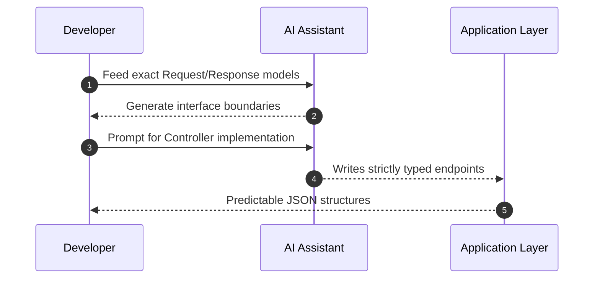
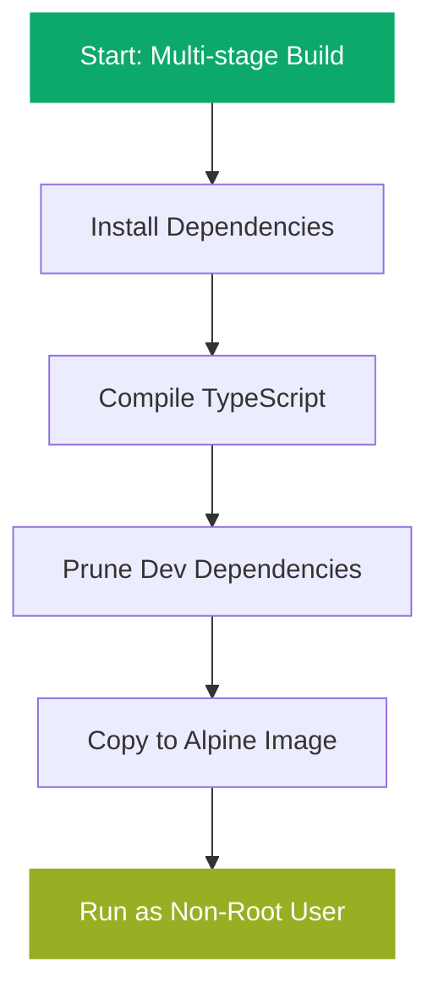
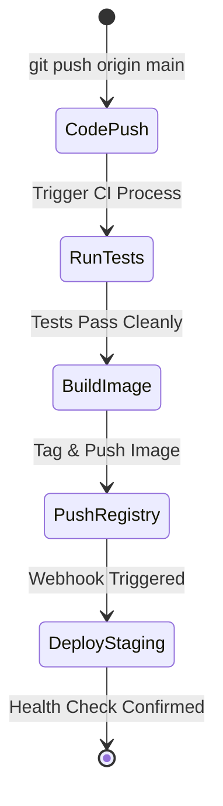

I used to dread the "blank canvas" phase of a new microservice. You sit down, open up an empty repository in your IDE, and suddenly gravity hits you. Before you can write a single line of useful business logic, you have to write the same boilerplate authorization guard, validation wrappers, and Docker container configurations you've written ten times before.

A few months ago, while building core infrastructure for AI Kosha at Unthinkable Solutions, I hit a breaking point. I had a tight deadline, a highly specific feature set to deliver, and absolutely no time to copy-paste config files manually while praying the imports lined up.

What changed for me was realizing that AI isn't here to do my engineering—it's here to do my typing. I stopped treating code-generation assistants like junior developers who needed hand-holding. Instead, I started using them like highly specific, context-aware template engines. This shift in mindset took my "zero to deployed" time from a stressful three days to a predictable single afternoon.

Here is exactly what that workflow looks like today.

## Scaffold The Plumbing First

The biggest time-waster in backend development isn't complex logic; it's wiring up the foundational plumbing. 

I used to spend my entire first morning just getting NestJS connected to the database, setting up Redis for caching, and writing the underlying base repositories. It’s mentally draining before the actual work even begins. You lose momentum fighting with ORM configurations or environment variable parsing. 

Now, my first step is feeding a rigid prompt to my IDE assistant. I hand it a raw copy of my database schema SQL, and I tell it exactly how to scaffold the Data Transfer Objects (DTOs), interfaces, and basic CRUD operations. I don't ask it to build the system. I ask it to build the skeleton. 

The mistake was asking for too much at once in the past. If you ask an AI for a "complete user authentication feature," you get a tangled mess of hallucinated imports and outdated JWT libraries. If you ask for specific, strongly-typed NestJS boilerplate bounded to a specific context, you get exactly what you need.

{/* IMAGE: A side-by-side comparison visual showing a messy folder structure of manually created files vs. a cleanly generated, modular backend structure following best practices. */}

```typescript
import { Injectable, NotFoundException } from '@nestjs/common';
import { InjectRepository } from '@nestjs/typeorm';
import { Repository } from 'typeorm';
import { User } from './entities/user.entity';

@Injectable()
export class UsersService {
  constructor(
    @InjectRepository(User)
    private readonly userRepository: Repository<User>,
  ) {}

  async findActiveUser(id: string): Promise<User> {
    // I generate this repository access pattern from the entity definition 
    // rather than typing it out from scratch every single time.
    const user = await this.userRepository.findOne({ 
      where: { id, isActive: true } 
    });
    
    if (!user) {
      throw new NotFoundException('User not found or inactive');
    }
    return user;
  }
}
```

Delegate the boilerplate so you can save your mental energy for the actual system design.

## Design the API Contract Before the Logic

You can't ask an AI to write reliable endpoints if it doesn't know the inputs and outputs it's supposed to handle.

Before diving into controllers or services, I finalize the exact API contract. This means writing out the Swagger annotations, the request payloads, and the response models before anything else. I learned this the hard way: if the AI has to guess the return type midway through writing the business logic, it will drift off course. By explicitly defining the data contracts first, the assistant has an absolute boundary to work within.

This looked fine in dev when I just winged it, but broke in real usage heavily during another project when client teams got mismatched JSON structures. When a frontend application expects a nested object but receives a flat array, everything crashes cleanly and suddenly. Now, the contract is law. The AI simply implements the logic to fulfill that predefined law.



Strict boundaries lead to predictable code generation, completely avoiding nasty architectural drift.

## The Debugging Loop Is About Context

AI won't write perfect code, but it is insanely good at finding its own mistakes if you feed it the right context.

During a deployment for Interview Instructor, our platform started quietly dropping database transactions under heavy load. Normally, I would spend hours digging through Postgres backend logs trying to match isolated transaction IDs. I'd sit there correlating timestamps in a terminal window.

Instead, I completely changed my approach to debugging. I dumped the exact raw error logs, the corresponding service file, and my TypeORM configuration directly into the prompt window. The key is to give the assistant context of *how* the app is running, not just what the code says. I explicitly tell it my Node version, my framework version, and exactly what step in the request lifecycle failed. 

Because I gave it the full picture, it spotted a missing `await` inside a database transaction block in seconds.

{/* IMAGE: A simple screenshot mockup of a code editor split-screen, showing a stack trace on the left and an AI assistant highlighting the missing "await" on the right. */}

```typescript
async processInterviewResult(resultData: ResultDto) {
  const queryRunner = this.dataSource.createQueryRunner();
  await queryRunner.connect();
  await queryRunner.startTransaction();

  try {
    const savedResult = await queryRunner.manager.save(Result, resultData);
    
    // The AI caught this missing await that caused silent connection leaks
    await this.notifyUser(savedResult.id); 
    
    await queryRunner.commitTransaction();
  } catch (err) {
    await queryRunner.rollbackTransaction();
    throw err;
  } finally {
    await queryRunner.release();
  }
}
```

Treat stack traces like breadcrumbs—feed them directly back to your tools to resolve issues in minutes instead of hours.

## Containerization Without the Headaches

Writing deployment scripts is syntax-heavy, tedious, and prone to invisible spacing errors.

When moving from local development to a staging environment, I used to dread writing out Dockerfiles. Getting the Node version right, shrinking the final image size, and handling the package managers gracefully is a chore. Now, my workflow treats infrastructure-as-code as just another text generation task.

I describe the desired state cleanly: “I need a multi-stage Dockerfile for a Node 20 NestJS app that uses pnpm, caches layer dependencies correctly, and runs as a non-root user.” 

This works beautifully because Docker commands are highly standardized. The tool rarely hallucinates an invalid Docker instruction compared to when it tries to write complex, domain-specific business logic. It knows exactly how to craft a tiny Alpine Linux image, handle `node-gyp` dependencies, and clean up the unneeded packages before deployment.

{/* IMAGE: A visual comparison chart showing a bulky 1GB Docker image dropping to a lean 150MB Alpine image after applying a generated multi-stage build. */}



Let automation handle your infrastructure details so you can deploy securely without the usual dread.

## Automating the Deployment Pipeline

Getting the code to run locally is only half the battle; getting it to the server seamlessly is the rest.

In the past, setting up continuous integration meant digging through GitHub Actions documentation for hours to remember exactly how to cache `node_modules` across build steps or pass encrypted environment variables. It was always a frustrating roadblock between my completed code and a live active endpoint.

Now, my workflow heavily relies on AI to write these YAML configurations for me. I provide it with the repository secrets I have set up and the exact steps I want to happen: lint the codebase, run the unit test suite, build the Docker container, and push it up to our cloud registry.

The generated pipeline is usually accurate out of the box. I might need to tweak a file path or adjust a timeout setting, but the bulk of the tedious syntax is handled. This is where the sheer speed of this workflow truly shines. By the time I have finished my afternoon coffee, a microservice that existed only in my head that morning is now accessible via a live URL, backed by automated tests and tightly governed by a solid pipeline.

{/* IMAGE: A minimal UI graphic representing a deployment pipeline with green checkmarks passing across Lint, Test, Build, and Deploy stages. */}



A deployment pipeline shouldn't be an afterthought; it should be the very first architectural piece you generate after scaffolding the boilerplate.

## The Reality Check

AI won't make you a senior engineer, but it will make you a much faster one if you actually know what to ask for.

The biggest takeaway from my experience working on real, load-bearing systems like ITPO Venue Booking and AI Kosha is that engineering judgment remains the only thing that actually matters. An assistant can write a hundred lines of data access code in ten seconds, but it has no idea if those lines are actually solving the correct business problem. It doesn't know if your database indexing strategy makes sense for your specific read-heavy scaling issues.

If you treat AI as a magic wand that builds entire applications from thin air, you will inevitably end up with fragile, unmaintainable architecture. But if you treat it as an extremely fast typist that knows every framework's documentation perfectly, your personal productivity will absolutely skyrocket.

Stop typing out the boilerplate yourself. Outline the architecture clearly, strictly define your contract boundaries, and let the tools do the heavy lifting. That is the only real way you go from a blank page to a deployed microservice before the day is over.
