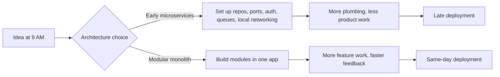
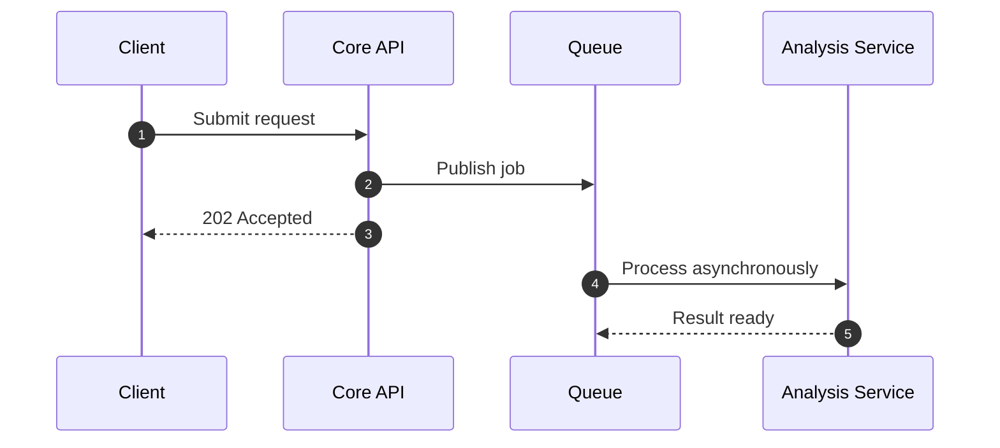
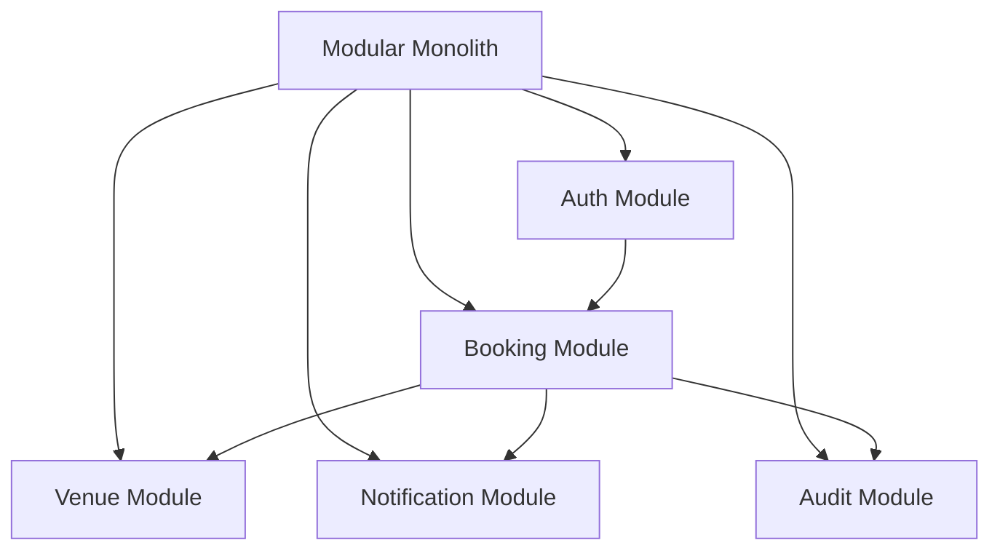

The fastest way to turn a simple product into a complicated system is to split it into services before the first feature is stable.

I have seen this pattern too many times. On a whiteboard, it looks disciplined: auth service, booking service, notification service, analytics service. In delivery, it often becomes the opposite. Time disappears into gateway config, environment drift, service-to-service auth, local setup, deployment ordering, and debugging across multiple logs before the first workflow is truly working.

What changed for me was simple: I stopped asking which architecture looked more advanced and started asking which one would create the most delivery leverage with the least operational drag.

That question changed how I build.

## Architecture should buy you something real

A good architecture decision should buy at least one meaningful advantage:

- faster delivery
- clearer ownership boundaries
- safer scaling
- better fault isolation
- team autonomy

If it buys none of those yet, it is probably architecture theater.

That is why I no longer treat microservices as the default sign of maturity. They are a powerful tool, but they are also an expensive one. They make sense when the system has already earned that complexity.

For most early products, internal tools, government workflows, admin-heavy platforms, and fast-moving B2B systems, the better first move is usually a modular monolith.

## A one-day deadline exposes architecture truth fast

When time is tight, architecture stops being philosophical.

If I have one day to move from idea to deployed backend, I do not want five repos, three pipelines, and cross-service debugging before the first user flow is complete. I want one codebase I can run, inspect, test, and deploy without spending half the day wiring the platform around the product.

That does not mean microservices are wrong. It means they come with a setup cost, and that cost is easiest to see when the delivery window is brutally short.



That tradeoff becomes very obvious on real product work. In systems where requirements are still moving, the hardest part is rarely writing a controller or repository. The harder part is keeping the entire system understandable while business rules keep changing.

The takeaway: short deadlines expose whether your architecture is accelerating delivery or delaying it.

## Microservices help when boundaries are operationally real

I am not against microservices. I use them when the boundary already exists in behavior, scale, failure tolerance, or deployment needs.

That is the test I trust.

A separate service makes sense when one part of the platform has:

- a clearly different load profile
- a different release cadence
- long-running or asynchronous work
- isolation requirements for failure or compliance
- an ownership boundary that is stable enough to enforce with contracts

That is where microservices stop being fashionable and start being useful.

### Where they usually earn their keep

Background jobs, notifications, document processing, media pipelines, AI inference, search indexing, and audit/event ingestion are common examples. These workloads often behave differently from user-facing CRUD APIs. They retry differently, scale differently, fail differently, and usually do not belong in the same request lifecycle.

For example, if the API must respond quickly but AI analysis may take seconds or minutes, that is a real boundary. In that case, separating the heavy worker is practical, not performative.



This split works because the contract is clear. The API owns validation, orchestration, and persistence. The worker owns heavy processing. They are not pretending to be separate systems. They actually are separate systems.

The takeaway: microservices work best when the product already behaves like multiple systems.

## A modular monolith gives you speed without giving up structure

A modular monolith is still one deployable application, but it should not be one giant shared mess.

This is where the discussion often gets lazy. People hear “monolith” and assume “spaghetti.” That is not an architecture critique. That is a code discipline problem.

A strong modular monolith can still have:

- hard module boundaries
- explicit interfaces
- separate domain services
- internal events
- isolated data access paths
- controlled dependency direction

That gives you most of the development speed advantages of a monolith without giving up architectural clarity.

In products with fast-changing business logic, that matters a lot. A booking flow, for example, can cut across availability, approvals, notifications, schedules, payments, and audit trails. Early in a product, those rules change often. Keeping those modules in one deployable unit makes it easier to evolve the workflow without also changing network contracts, deployment pipelines, and operational dependencies.



The important part is discipline. Inside one application, I still keep the seams hard:

- each module owns its business rules
- each module controls its own data access
- cross-module interaction happens through explicit services or domain events
- shared code stays minimal and boring
- no module reaches into another module’s internals just because it can

That is not a compromise. That is architecture.

The takeaway: a modular monolith is often the fastest serious architecture, not the lazy one.

## The hidden tax of microservices shows up in boring places

The real cost of microservices is rarely visible in the architecture diagram.

It shows up in the operational edges:

- local development
- observability
- distributed tracing
- retries and idempotency
- environment management
- test orchestration
- deployment ordering
- partial failure handling
- contract drift between teams and services

That is why idealized comparisons are dangerous. People compare a clean microservices diagram against a messy monolith codebase and conclude the diagram is better. In reality, the comparison should be between two well-designed systems with their full delivery and operations cost included.

The first pain point is usually not scale. It is coordination.

If four services must change together to deliver one feature, you have not reduced coupling. You have simply moved that coupling onto the network, where it is slower to test and harder to debug.

```typescript
@Controller('bookings')
export class BookingController {
  constructor(
    private readonly bookingService: BookingService,
    private readonly eventBus: EventEmitter2,
  ) {}

  @Post()
  async create(@Body() dto: CreateBookingDto) {
    const booking = await this.bookingService.create(dto);
    this.eventBus.emit('booking.created', { bookingId: booking.id });
    return booking;
  }
}
```

I like this pattern inside a modular monolith because it creates a clean architectural seam without forcing a distributed deployment model on day one. Notifications, analytics, and audit logic can react to events, while I still debug and deploy one application.

The takeaway: distributed systems charge you rent every day, even when traffic is low.

## A modular monolith only works if you enforce real boundaries

This is the part many teams skip.

If every module shares the same tables, imports each other freely, and bypasses each other’s services, you do not have a modular monolith. You have a monolith with folders.

A modular monolith earns its name when it has real architectural constraints.

### The rules I usually enforce

1. A module owns its business capability.
2. Other modules talk to it through an explicit interface.
3. Shared utilities do not become a dumping ground for domain logic.
4. Cross-cutting concerns stay infrastructural, not business-owned.
5. Internal events are allowed, but event usage is intentional rather than random.
6. Extraction is planned by seam design, not by speculative decomposition.

That last point matters a lot. Even when I keep one deployable app, I still design for future extraction where it is reasonable.

```typescript
@Injectable()
export class BookingCreatedHandler {
  @OnEvent('booking.created')
  async handle(event: { bookingId: string }) {
    await this.notificationService.sendConfirmation(event.bookingId);
    await this.auditService.record('booking_created', event.bookingId);
  }

  constructor(
    private readonly notificationService: NotificationService,
    private readonly auditService: AuditService,
  ) {}
}
```

This gives me an internal seam. If notifications later need separate scale, failure isolation, or ownership, I already know where the boundary is. I can externalize the event path when the system has actually earned it.

The takeaway: design the seam early, but delay the network boundary until the pressure is real.

## The split point should come from pressure, not fashion

I only split a service when the pain is specific and persistent.

Not because “we might scale later.”
Not because “this is what modern systems look like.”
Not because “microservices sound more senior in an interview.”

I split when I can point to a real operational reason.

### Questions I ask before extracting a service

- Does this module need to scale differently from the rest of the app?
- Does it have a very different runtime pattern, such as heavy async processing?
- Is it creating deployment risk for unrelated features?
- Is the contract stable enough that a hard boundary will reduce change friction?
- Is there a real ownership boundary between teams?
- Would failure isolation materially improve system resilience?

If most answers are no, I keep it inside the modular monolith.

That rule has saved me from premature complexity more than once.

## A practical decision framework

If I were reviewing an architecture proposal, I would simplify the choice like this:

| Situation | Better default |
| --- | --- |
| Early-stage product with changing requirements | Modular monolith |
| Small team shipping fast | Modular monolith |
| CRUD-heavy business workflows | Modular monolith |
| Multiple domains but one release cadence | Modular monolith |
| Heavy async processing isolated from core API | Hybrid: monolith + worker |
| Different scaling and failure profiles | Microservices |
| Stable domain contracts across teams | Microservices |
| Independent team ownership and release cycles | Microservices |

This is why my default is not “never use microservices.”
My default is “do not distribute what has not yet proven it needs distribution.”

## What I would ship today

If I had to take a new product from zero to production today, I would start with a modular monolith almost every time.

I would keep auth, business workflows, persistence, admin operations, and core APIs inside one NestJS application. I would separate modules cleanly. I would introduce internal events where decoupling helps. If there were a genuinely heavy async workload, such as AI processing, document generation, or media transformation, I would isolate that as a worker only when the behavior clearly justified it.

That gives me the balance I care about most early on:

- fast development
- sane debugging
- simple deployment
- room to evolve
- clear seams for later extraction

That is not ideology. It is operational pragmatism.

## Final thought

Microservices are powerful, but they are not a free upgrade.

A modular monolith is usually the better starting point when the product is still discovering its workflows, the team is still moving quickly, and the business logic is still changing under your feet.

Start with hard internal boundaries. Keep one deployable unit while the system is learning what it is. Extract services only when scale, failure isolation, runtime behavior, or team autonomy creates a reason that is difficult to ignore.

That path is less flashy than starting with ten services. It is also more honest.

And in my experience, honest architecture usually ships faster, breaks in fewer surprising ways, and creates better options when the system becomes real.
