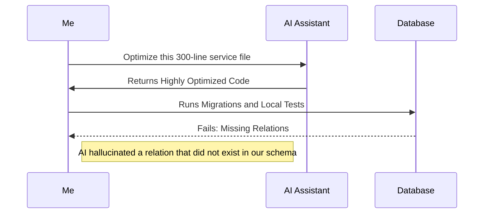
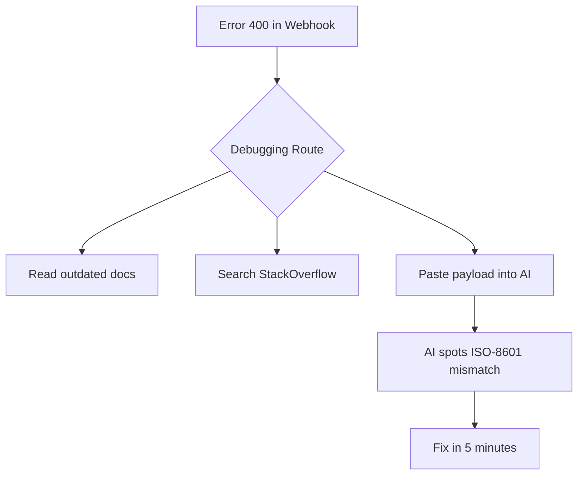
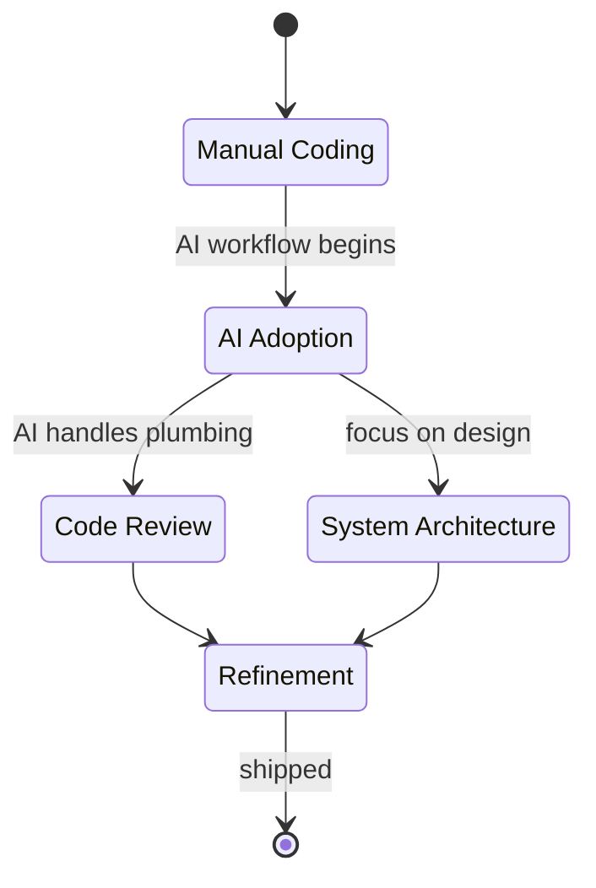

Six months ago, I was trapped in a cycle familiar to most backend developers: spending over three hours a day writing repetitive DTOs, wiring up simple CRUD endpoints, and staring at generic database constraint errors. It wasn't the hard engineering that was draining my time; it was the plumbing. 

Today, that plumbing work is almost entirely handled by AI, freeing me up to focus on system design, database optimization, and harder business logic. But the transition wasn't just turning on an AI assistant and walking away to grab coffee. It was messy. I broke builds. I introduced bugs. 

Here is exactly what worked, what completely broke when I tried to force it, and how I actually use AI for daily backend engineering today.

## Drowning in Boilerplate

If you are a backend engineer writing standard mapping logic by hand in 2024, you are wasting your hours. 

When I was working on the core API for ITPO Venue Booking, the scope of the entities we had to manage was massive. We had dozens of inter-connected SQL tables for venues, bookings, pricing tiers, availability slots, and user roles. Writing the TypeScript interfaces, Prisma schemas, and standard NestJS controllers for these was completely uninteresting work.

I decided to offload the initial scaffolding to a large language model. I fed it our standard database schema conventions and asked it to generate the NestJS services and controllers for the new entities.

{/* IMAGE: A clean split-screen visual showing a raw SQL schema on the left and a fully scaffolded NestJS directory tree on the right */}

```typescript
// The AI generated this pattern instantly for 40+ entities
@Injectable()
export class VenueService {
  constructor(private prisma: PrismaService) {}

  async createPricingTier(data: CreatePricingDto) {
    const venue = await this.prisma.venue.findUnique({ where: { id: data.venueId } });
    if (!venue) throw new NotFoundException('Venue missing');
    
    return this.prisma.pricingTier.create({ data });
  }
}
```

The AI generated this kind of boilerplate instantly. Was it perfect? No. It constantly missed our team's specific custom error-handling wrappers and authorization guards. But modifying thirty lines of generated code is significantly faster than typing fifty lines from scratch. 

The immediate lesson became clear: AI is a terrible software architect, but it is an exceptionally fast typist. Treat it like an enthusiastic junior developer who knows the syntax perfectly but has absolutely no context on your business rules.

## The Context Trap: How AI Broke My Tests

The biggest mistake I made early in the transition was overestimating the AI's ability to handle broad, sweeping refactoring. 

While working on the AI Kosha project, I needed to optimize a series of nested database queries that were causing massive latency spikes during peak usage. I got lazy. I pasted the entire 300-line service file into my AI prompt and asked it to "optimize the database calls and reduce the latency."



The AI confidently returned a beautifully concise version of the file using a complex analytical query approach. It looked fantastic. The problem? It hallucinated a Prisma entity relation that did not exist in our actual schema. It looked completely valid, passed the basic syntax checks in the IDE, and then immediately blew up when I ran my test suite.

{/* IMAGE: A debugging screenshot showing the hallucinated Prisma error side-by-side with the AI's confident text explanation */}

I learned this the hard way: AI has no idea what your database actually looks like unless you explicitly enforce that context. 

I drastically changed my workflow after that. Instead of asking it to optimize a whole file, I started giving it specific, isolated functions along with the exact database schema it needed to understand. Context is everything. Give the AI tight, rigid boundaries, and it will give you highly functional code.

## Generating Tests That Actually Mean Something

Writing unit tests often feels like a necessary evil. You know you need them for stability, but they aggressively slow down your feature delivery timeline.

For Interview Instructor, we had complex evaluation logic where candidate answers were scored against multiple custom technical criteria. Writing the edge-case tests for this scoring engine manually would have taken at least three days. 

This quickly became my favorite daily use case for AI. I grouped the pure functions and asked the AI to generate Jest tests covering aggressive edge cases, null inputs, and unexpected data types.

```typescript
describe('InterviewScoreEvaluator', () => {
  it('should handle zero-length technical responses gracefully by flagging', () => {
    const result = evaluator.calculateScore({ technical: '', behavioral: 'good' });
    expect(result.technicalScore).toBe(0);
    expect(result.flags).toContain('MISSING_TECH_RESPONSE');
  });

  it('should ignore duplicate keyword hits in the natural language payload', () => {
    // The AI realized duplicate words might break the simple frequency counter
    const result = evaluator.calculateScore({ technical: 'AWS AWS AWS', behavioral: 'ok' });
    expect(result.technicalScore).toBe(10); 
  });
});
```

It caught three edge cases—specifically around handling malformed JSON payloads and duplicate text entries—that I hadn't even considered. Now, to be fair, it did not write perfect mocks for our external dependencies. I still had to do that manually. But it generated a massive list of valid assertions that I could drop right into our suite.

{/* IMAGE: A "Before vs After" bar chart showing time spent writing core business logic versus time spent writing unit tests, highlighting the massive reduction in testing time. */}

The takeaway here is simple: Stop writing baseline assertions yourself. Let the model generate the massive matrix of test cases, and you focus on locking down the complex dependency mocking.

## Debugging External Integrations Fast

One of the most frustrating parts of backend development is dealing with third-party APIs that have incomplete or outdated documentation.



Recently, we were dealing with a webhook integration that kept failing quietly. The third-party documentation was hopelessly outdated. Instead of diving into endless support forums, I took the raw HTTP payload, the exact headers we were sending, and the ambiguous error code, and dropped them into the AI prompt. I asked it to spot the anomaly.

Within fifteen seconds, it pointed out that a specific timestamp field required string-based ISO-8601 formatting, while our NestJS system was serializing it as an integer epoch time. This is a problem that usually takes over an hour of digging through old GitHub issues to find. It was solved in five minutes.

## The Reality of an AI-Augmented Workflow

Replacing 40% of my backend work did not mean I was working 40% less. It meant my time shifted to where it actually belonged.

I no longer spend my mornings writing standard CRUD operations or formatting straightforward database queries. Instead, I spend that time designing cleaner data architectures, reviewing complex Pull Requests with more scrutiny, and ensuring our infrastructure can handle scaling.

{/* IMAGE: A simple infographic summarizing the shift in developer responsibilities: less typing, more reviewing and system design. */}



If you approach AI expecting it to build your entire backend system for you, you will end up with brittle, unmaintainable code that breaks under load. But if you treat it as a high-speed engine for doing your heavy lifting on isolated, well-defined tasks, it will fundamentally change how fast you can ship value.

The job of a software engineer isn't typing formatting. It's problem-solving. By letting AI handle the endless typing, I finally got back to solving the actual engineering problems.
